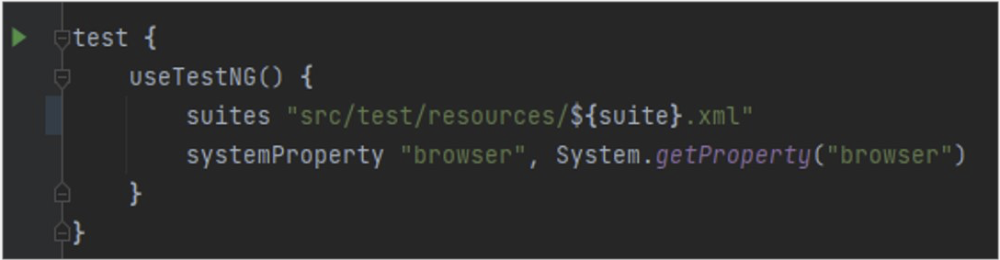
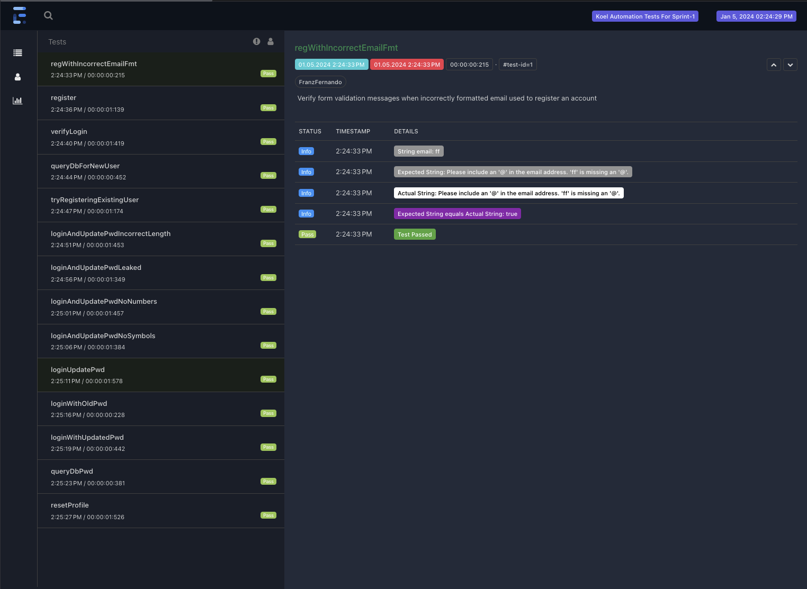
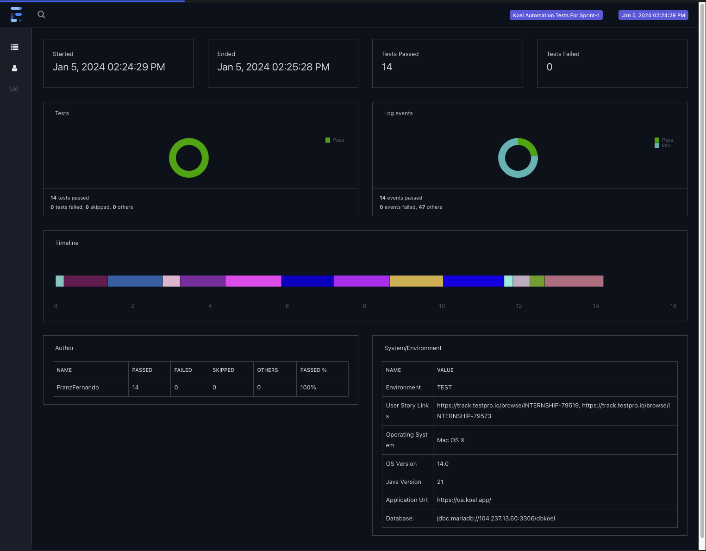
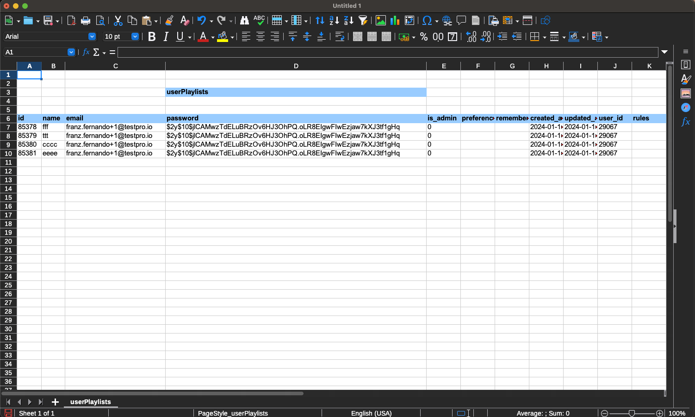

<h1>Koel Test Automation Framework</h1> 

<h3>Test Subject</h3>
koel: a personal music streaming server that works 

https://qa.koel.app 

<h3>Programming Language</h3>
Java  

<h3>Libraries/Tools Used</h3> 
* Selenium - Web automation 
* TestNG - Test execution 
* Cucumber - BDD testing  
* REST Assured - Validation of REST web services 
* MariaDB Connector/J - Database connector for Koel database 
* Apache POI - Reading and writing data in .xlsx, .xls format 
* LambdaTest - Cross-browser testing 
* log4j - Capturing logs 
* Extent Reports - reporting 
* Gradle - Build and package management 
* Jenkins - CI/CD 

<h3>Overview</h3>
This project provides a testing framework based on page object model to automate tests for the Koel web application. There are multiple branches for different types of testing: 
* db - Database testing
* api - REST api testing
* TestNG - TDD testing
* Cucumber - BDD testing

<h3>Getting Started</h3>
Follow these steps to get started with the Koel Test Automation Framework:  
1.) Clone this repository to your local machine.  
2.) cd Koel-Test-Automation  
3.) Rename "sample.env" to ".env" in src/test/resources  
4.) Fill in all the appropriate property values in the .env file 
5.) Choose a branch 
6.) gradle clean test 
NOTE: If using Jenkins be sure to add a variable in the build.gradle file 
 

<h3>Extent Reports</h3>
Extent reports will be generated in the reports/extent-reports folder. 
 

<h3>Store Results in Excel Files, or Use as a Dataprovider<h3>
 
