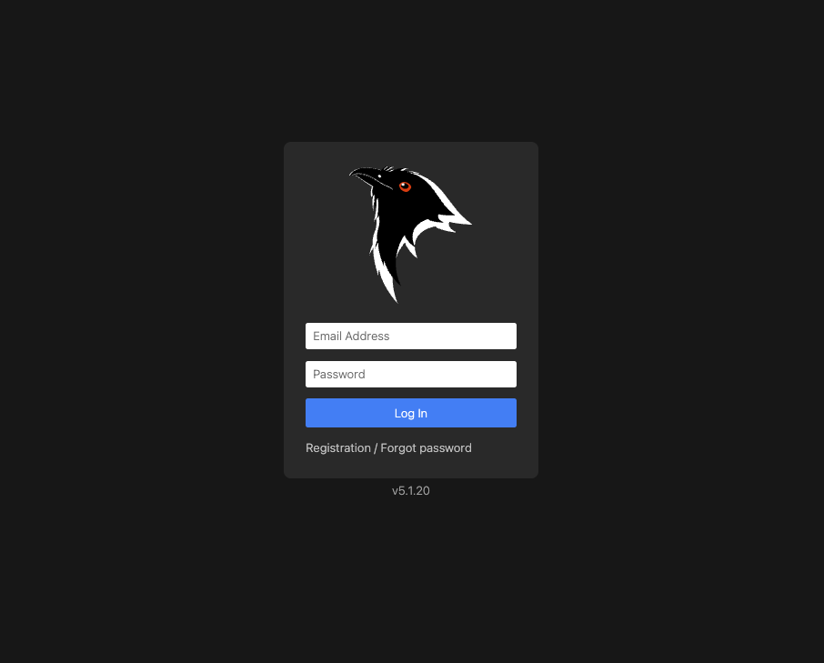

<h1>Koel Test Automation Framework</h1> 

 

<h3>Dependency</h3>
Java  
Gradle

<h3>Libraries Used</h3>  
Selenium 
TestNG 
log4j 
Extent Reports 

<h2>Overview</h2>
This project provides a testing framework based on page object model to automate tests for the Koel web application.  For the most part each branch serves a particular purpose: api, database, or web application testing.  

<h2>Getting Started</h2>
Follow these steps to get started with the Koel Test Automation Framework:  
1.) Clone this repository to your local machine.  
2.) cd Koel-Test-Automation  
3.) rename "sample.env" to ".env" in src/test/resources  
4.) fill in all the appropriate property values in the .env file 
5.) gradle clean test
<h2>Extent Reports</h2>
Extent reports will be generated in the reports/extent-reports folder. 
 

